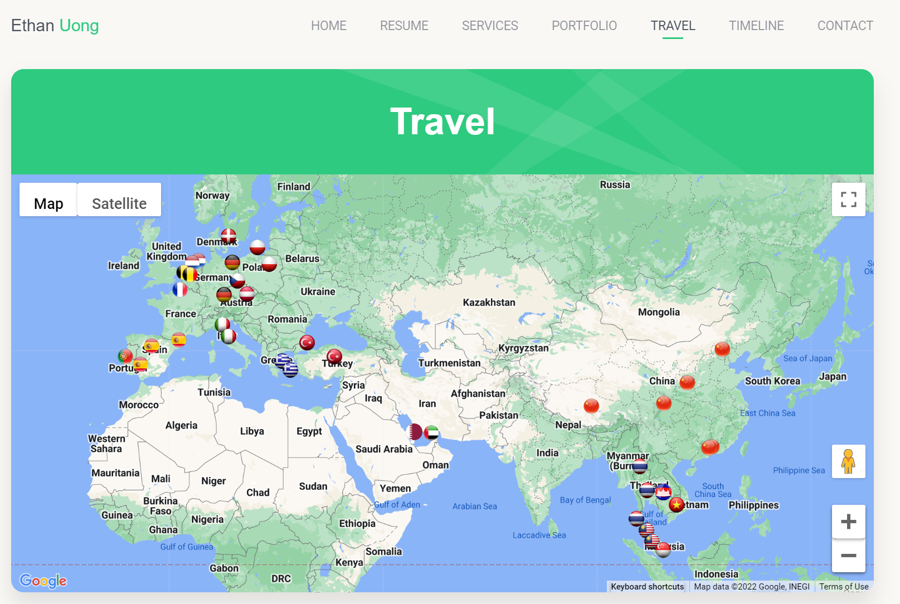
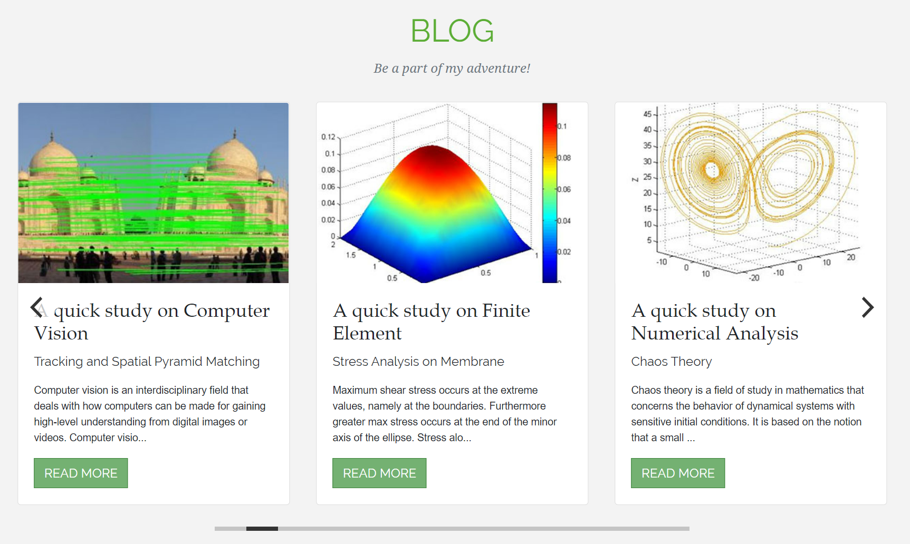
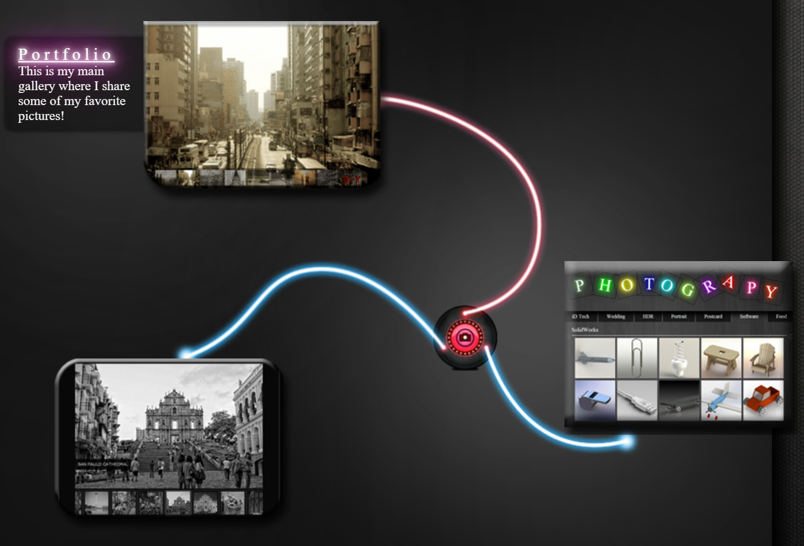

# ethanuong.com

I made a personal website in three themes.

Repo contains Github Actions to deploy static website onto my AWS S3 bucket. AWS_ACCESS_KEY_ID and AWS_SECRET_ACCESS_KEY can be stored as secrets on Github settings. Pipeline can be manually triggered under the Actions tab.

## Main Version

https://www.ethanuong.com

My main theme written in React. Here you get to see my portfolio and travels and learn a thing or two about me. Note that this codebase does not require or use Node.js. For my React repo on this website using Create-React-App, please check click [here](https://github.com/etuong/personal-website).

## Light Version

http://light.ethanuong.com/

A light theme in Bootstrap 4 and Angular 6. The idea behind this theme was inspired by "less is more." You will need Node.js and Angular CLI to get the modules and build.

## Dark Version

http://dark.ethanuong.com/

A dark theme that is more comprehensive than the light but isn't responsive. This version uses HTML5, CSS3, Javascript and jQuery.

